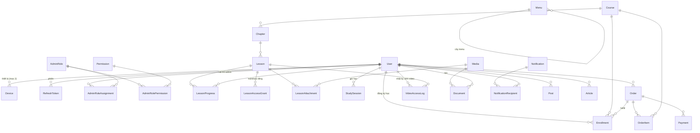

# ERD — LMS Dashboard

Nguồn chuẩn: [`prisma/schema.prisma`](../prisma/schema.prisma). Tài liệu này mô tả quan hệ & ý nghĩa các bảng theo 17 nhóm chức năng BA.

## Sơ đồ quan hệ (Mermaid)

## Nhóm bảng theo chức năng

| # (BA) | Chức năng | Bảng liên quan |
|---|---|---|
| 1 | Đăng nhập & bảo mật | `User`, `RefreshToken`, `VerificationToken` |
| 2 | Quản trị viên (RBAC) | `User(role=ADMIN)`, `AdminRole`, `Permission`, `AdminRolePermission`, `AdminRoleAssignment` |
| 3 | Quản lý học viên | `User(role=STUDENT)` |
| 4 | Thiết bị đăng nhập | `Device` (unique `userId+deviceId`, giới hạn 2) |
| 5 | Nội dung & bài viết | `Article`, `LandingSection` |
| 6 | Menu website | `Menu` (self-relation cây cha-con) |
| 7 | Hình ảnh & tập tin | `Media` (MinIO objectKey) |
| 8 | Khoá học | `Course → Chapter → Lesson`, `LessonAttachment`, `LessonAccessGrant` |
| 9 | Tiến trình học | `Enrollment`, `LessonProgress`, `StudySession` |
| 10 | Đơn mua & doanh thu | `Order`, `OrderItem` |
| 11 | Thanh toán | `Payment` (SePay/bank), `Order.status` |
| 12 | Kho tài liệu | `Document` (Google Drive/Docs/PDF/article) |
| 13 | Thông báo | `Notification`, `NotificationRecipient` |
| 14 | Video & chống chia sẻ | `Lesson.bunnyVideoId` + signed URL + watermark |
| 15 | Nhật ký truy cập | `VideoAccessLog` (xem video) + `ActivityLog` (login/mua/xem bài/tải) |
| 16 | Thống kê | tổng hợp từ `Order`, `User`, `Enrollment` |
| 17 | Cấu hình hệ thống | `SystemSetting` (key-value theo group) |

## Ghi chú thiết kế quan trọng

- **Một bảng `User` cho cả 2 role** (`role: ADMIN | STUDENT`). Admin có thêm RBAC qua `AdminRole`/`Permission`; `SUPER_ADMIN` = toàn quyền (`*`).
- **Khoá/mở bài học theo từng học viên:** `Lesson.isLocked` là mặc định; `LessonAccessGrant(unlocked)` override riêng cho 1 học viên (theo BA mục 8).
- **Quyền truy cập khoá học:** `Enrollment` quyết định đã mua. Logic mở khoá bài học:
  `grant=true → mở` › `grant=false → khoá` › `isPreview → mở` › `chưa enroll → khoá` › còn lại theo `isLocked`.
- **Tiến độ:** `LessonProgress` lưu chi tiết từng bài; `Enrollment.progressPct` là cache tính lại mỗi khi 1 bài chuyển sang `COMPLETED`.
- **Giờ học (biểu đồ):** `StudySession` ghi từng phiên (`durationSec`) → tổng hợp theo ngày/tuần.
- **Thanh toán đối soát:** nội dung CK = `Order.code` (`INV-xxxxxx`); webhook SePay parse mã này để fulfill — idempotent (đơn `PAID` rồi thì bỏ qua).
- **Chống chia sẻ video:** signed URL có `expires`; watermark = email học viên; `VideoAccessLog` lưu IP/thiết bị → endpoint `/access-logs/suspicious` phát hiện 1 tài khoản xem từ nhiều IP/thiết bị.
- Tất cả tiền dùng `Decimal(12,2)`, lưu VND.
